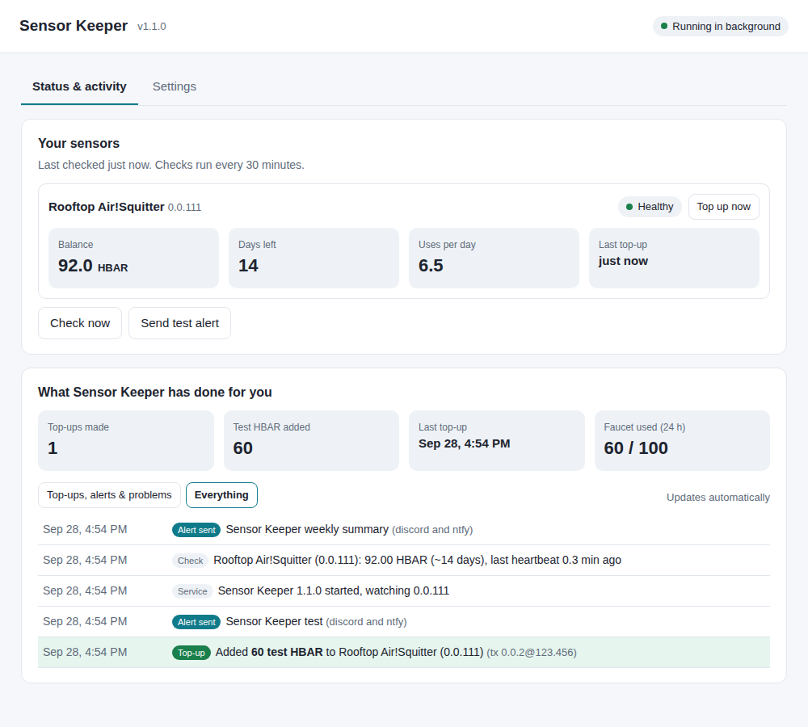

# Sensor Keeper

**Keeps your 4DSKY / Neuron sensor online by topping up its Hedera testnet HBAR automatically.**

Every 4DSKY sensor (Jetvision Air!Squitter and others) sends a heartbeat to the Hedera
testnet about every 40 seconds. Each heartbeat costs a tiny fee in *test* HBAR — roughly
6–7 HBAR a day. When the sensor's account runs dry, the heartbeats stop, the sensor shows
as offline, and it stops earning points.

Sensor Keeper runs quietly on any always-on computer (Mac, Windows, Linux, Raspberry Pi) and:

- checks each sensor's balance and heartbeats every 30 minutes (Hedera's public mirror node, read-only),
- tops the sensor up through **Hedera's official Faucet API** when it runs low,
- optionally checks a Jetvision Air!Squitter's status page on your network,
- alerts you (Discord or phone push) **only** when something needs attention,
- sends an optional weekly "all good" summary.

No Claude, no AI, no accounts with us. Nothing costs money — testnet HBAR is free and has no value.

> Unofficial community tool. Not affiliated with or endorsed by 4DSKY, Neuron or Hedera.

---

## Before you install: get a Hedera Portal access token (2 minutes)

Top-ups come from Hedera's free faucet, which needs a token tied to your own free Hedera
Portal account.

1. Go to **https://portal.hedera.com** and sign in (or create a free account).
2. Open your account settings and create a **Personal Access Token**.
3. Keep it handy — setup will ask for it. It's stored only on your computer.

You'll also need your **sensor's own Hedera device account ID** (looks like `0.0.1234567`) — the
account that pays for the sensor's heartbeats, not your wallet or rewards account. It's shown in
the 4DSKY app and in your sensor's Neuron setup; on hashscan.io it's the account with a steady
stream of "consensus submit message" transactions.

## Install

### Easiest: double-click

- **Mac:** download `Sensor-Keeper-Mac-installer.zip` from the
  [latest release](../../releases/latest), unzip, and double-click
  **Install Sensor Keeper (Mac).command**.
  If macOS says it can't be opened, right-click the file → **Open** → **Open**.
- **Windows:** download `Sensor-Keeper-Windows-installer.zip`, unzip, and double-click
  **Install Sensor Keeper (Windows).bat**. If SmartScreen appears, click **More info → Run anyway**.

### Terminal (one line)

macOS / Linux / Raspberry Pi:

```bash
curl -fsSL https://raw.githubusercontent.com/killgja/sensor-keeper/main/install.sh | bash
```

Windows (PowerShell):

```powershell
irm https://raw.githubusercontent.com/killgja/sensor-keeper/main/install.ps1 | iex
```

Either way, the **Sensor Keeper app** opens in your web browser (it runs only on your own
computer). Fill in the Settings tab and press **Save**:

1. your sensor account ID(s) — press **Check** to confirm each one on Hedera,
2. your Hedera Portal access token,
3. when to top up (default: below 40 HBAR, 60 HBAR at a time),
4. where to send alerts (optional),
5. then press **Start background service**.

On a computer without a screen (e.g. a headless Raspberry Pi) the installer asks the same
questions in the terminal instead.



## Everyday use

Open **Sensor Keeper** from your Applications folder (Mac), Start menu or desktop icon (Windows),
or app menu (Linux) — or run `sensor-keeper ui`. The app shows:

- **Status & activity** — each sensor's balance, days of HBAR left, daily use and health, plus a
  running log of everything Sensor Keeper has done: top-ups (with Hedera transaction IDs), alerts
  sent and problems found. "Top up now", "Check now" and "Send test alert" buttons are here too.
- **Settings** — change any detail and press Save; the background service picks it up within a
  minute. Start or stop the background service here.

The app window is only reachable from your own computer and closes itself a minute or two after
you close the browser tab. The background service keeps running either way.

Terminal commands, if you prefer:

```text
sensor-keeper ui            open the app window
sensor-keeper status        balances, days left, last top-up, any problems
sensor-keeper check         run a check right now
sensor-keeper topup 0.0.x   request a top-up now
sensor-keeper setup         change settings in the terminal
sensor-keeper logs          last 40 log lines
sensor-keeper test-alert    make sure alerts reach you
sensor-keeper uninstall-service
```

Add `--dry-run` to `check`, `topup` or `run` to see what it would do without requesting HBAR.

## Alerts

| Channel | How |
|---|---|
| Discord | Channel settings → Integrations → Webhooks → New webhook → copy URL |
| Phone push | Install the free **ntfy** app by Philipp Heckel ([iPhone](https://apps.apple.com/us/app/ntfy/id1625396347) · [Android](https://play.google.com/store/apps/details?id=io.heckel.ntfy)) — white bell on a teal icon. **Not** "Ntfy me" or "Ntfy me - Next Gen"; those are unrelated apps that won't receive these alerts. Tap **+**, subscribe to a hard-to-guess topic name on the default ntfy.sh server (anyone who knows the name can read your alerts), and give setup the same name. Then run `sensor-keeper test-alert`. |

### Phone push alerts with ntfy (step by step)

[ntfy](https://ntfy.sh) is a free notification relay: Sensor Keeper posts a short message to a
*topic* on ntfy.sh, and every phone subscribed to that topic gets it as a normal notification.
No account or sign-up is needed.

1. **Install the right app** — **ntfy** by Philipp Heckel (white bell on a teal icon):
   [iPhone / iPad](https://apps.apple.com/us/app/ntfy/id1625396347) ·
   [Android (Google Play)](https://play.google.com/store/apps/details?id=io.heckel.ntfy) ·
   [Android (F-Droid)](https://f-droid.org/packages/io.heckel.ntfy/).
   ⚠️ **Not** "Ntfy me" or "Ntfy me - Next Gen" — those are unrelated apps and won't receive these alerts.
2. **Pick a topic name.** It works like a password: anyone who knows it can read (or send to) your
   alerts, so make it unique and hard to guess, e.g. `sk-yourname-7q4m2x`. Letters, numbers, `-` and `_` only.
   Don't use a generic name like `4dsky` — other operators might pick the same one.
3. **Subscribe on your phone.** Open ntfy → tap **+** → enter your topic name exactly (it's case-sensitive) →
   leave "Use another server" **off** (the default `ntfy.sh`) → **Subscribe**.
4. **Allow notifications** when your phone asks (iPhone: Settings → Notifications → ntfy → Allow).
5. **Tell Sensor Keeper the topic.** In the app's Settings tab, type the same name in "Phone push — ntfy topic"
   and press Save (or in the terminal: `sensor-keeper setup`).
6. **Test it:** press **Send test alert** on the app's Status tab (or run `sensor-keeper test-alert`) — a
   "Sensor Keeper test" notification should arrive within seconds.

To change topics later, subscribe to the new name in the app, run `sensor-keeper setup` with the new
name, then remove the old subscription. Alerts go to every phone subscribed to the topic, so family
members can subscribe too.

You'll get an alert when a sensor stops sending heartbeats, a top-up fails, your token is
rejected, a sensor is nearly out of HBAR, the Air!Squitter status page shows a problem or goes
unreachable, or a sensor account disappears (testnet reset) — and a short "resolved" note when
it recovers. Repeat reminders are limited to every 12 hours.

## Hedera's limits (built in)

Hedera's Faucet API allows **100 test HBAR per person per rolling 24 hours** and **one funding
per destination account per 24 hours**. A sensor uses about 7 HBAR a day, so a single top-up
every week or so is plenty. With several sensors, the daily 100 is shared and top-ups are
spread out automatically. Sensor Keeper tracks this locally so it never asks for more than
allowed.

Hedera documents the Faucet API specifically for "scripts, CI/CD pipelines, SDKs, or agentic
workflows": https://docs.hedera.com/learn/getting-started/faucet-api

## Testnet resets

Hedera resets the testnet every few months, which deletes every testnet account — including
your sensor's. Sensor Keeper will alert you. To recover, create/claim a new device account in
the 4DSKY app, re-run your sensor's Neuron setup with it, then run `sensor-keeper setup` and
enter the new ID.

## Privacy & security

- Settings are stored in `~/.sensor-keeper/config.json` (Windows: `%USERPROFILE%\.sensor-keeper`),
  readable only by your user account.
- **No private keys** are ever requested or stored. The faucet sends HBAR straight to your sensor.
- The only places it talks to: Hedera's mirror node, Hedera's faucet, your sensor's status page
  (if you add it), and the alert services you choose.
- It's one readable file: [`keeper.js`](keeper.js). No third-party packages.

## Uninstall

```bash
sensor-keeper uninstall-service
rm -rf ~/.sensor-keeper          # Windows: delete %USERPROFILE%\.sensor-keeper
```

## Build from source

Needs Node.js 18+ only: `node keeper.js setup`. Standalone programs are built with
[Bun](https://bun.sh) by the GitHub Actions workflow in `.github/workflows/release.yml`
whenever a `v*` tag is pushed.

## License

MIT — see [LICENSE](LICENSE).
